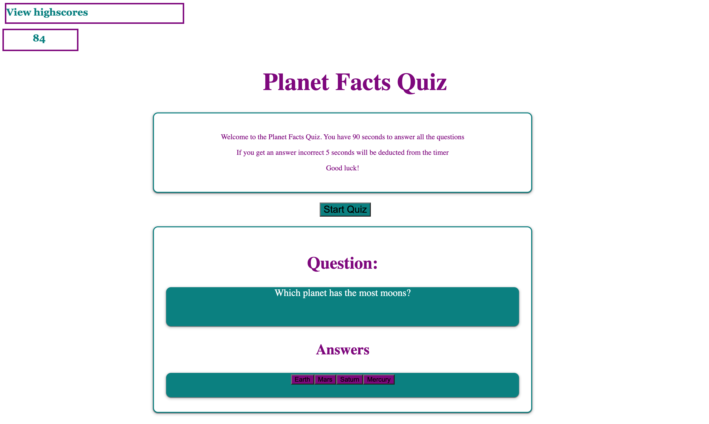

# Code Quiz

# Description

This app is a quiz about planets. The user has 90 seconds to answer all the questions. 

## Deployed App link 

https://blen90.github.io/code-quiz/

## Screenshot of the app

# Table of Contents

* [Installation](#installation)
    
* [Usage](#usage)

* [Technology](#technology)

* [License](#license)

* [Contributors](#contributors)

* [Questions](#questions)

# Installation

Visit the deployed app to start the quiz in the following link: https://blen90.github.io/code-quiz/

# Usage

The user can start the quiz and will have 90 seconds to answer correctly. 

# Technology

* HTML
* CSS
* JavaScript

# License 

This project is governed by: MIT License

# Contributors

Blenda Orellana

# Questions

If you have any questions about the repo or the app please feel free to contact me
 * Email: blen.or90@gmail.com
 * Github: https://github.com/blen90
